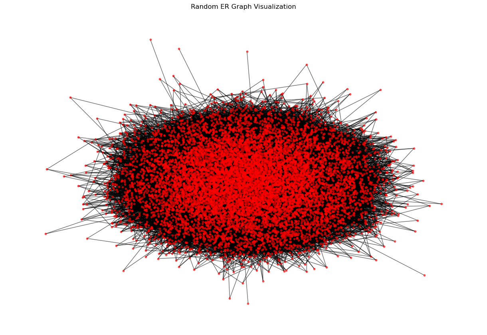
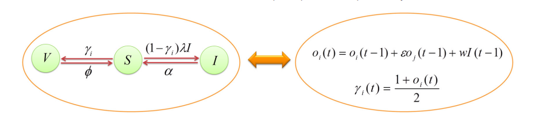
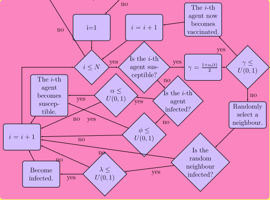

# Sudden transitions in coupled opinion and epidemic dynamics with vaccination in a network

## Aim 

The project aims to explore the relationship between the SIS epidemic model, vaccination dynamics, and opinion dynamics. Using continuous opinions and Monte Carlo simulations, we seek to understand how these factors interact within a population.

## Instructions to Run

1. Clone the repository to your local machine.<br>
2. Navigate to the project directory in your terminal.<br>
3. Install the required packages using pip:
   ```
   pip install -r requirements.txt
   ```
4. Run the simulations using the following commands:
   - Baseline Simulation:
     ```
     python baseline_simulation/baseline_Simulation.py
     ```
   - Erdos-Renyi Network Simulation:
     ```
     python ER_network_simulation/ER_network_simulation.py
     ```
     <br>
5. The simulation outputs will pop up in a new window.
<br>

## Simulation Details

### The Erdos-Renyi Network 
 N = 10000, p = 0.001



 - Isolated nodes are randomly connected to any node in the network to form a connected network.

 - The # of infected, # of vaccinated, and # of susceptible individuals will be displayed in the terminal for each monte carlo step.

  - The simulation will run for 100 monte carlo steps.


## Mathematical Model

The simulations are based on the following equations:

1. **Baseline Simulation Equations:**

    
2. **Erdos-Renyi Network Simulation Equations:**

    - Opinion Dynamics:
        -$$  o_i(t+1) = o_i(t) +\frac{ \epsilon}{K_i} \sum_{j \in N_i} A_{ij} o_j(t) + \frac{w}{K_i} \sum_{j \in N_i} A_{ij} \frac{\sum_{k \in N_j} I_k}{K_j}$$
    
    - Epidemic Dynamics:
      

## Libraries and Modules Used

- ***NetworkX***: For generating random graphs and network analysis.
- ***NumPy***: For numerical computations and array operations.
- ***Matplotlib***: For data visualization.
- ***Pipreqs***: For generating the `requirements.txt` file.

## Outputs

The simulation outputs are saved in the `outputs` folders within the `baseline_simulation` and `ER_network_simulation` directories.

## Contributors

1. Shreeya Singh
2. Srujana Vanka
3. Smruti Biswal
---


